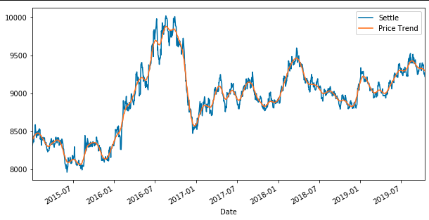
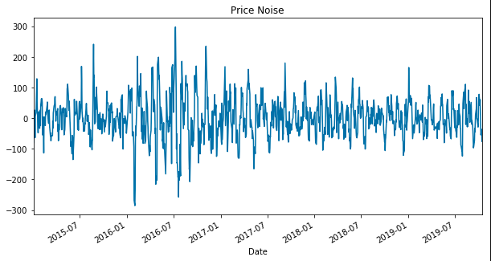
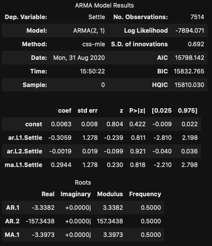
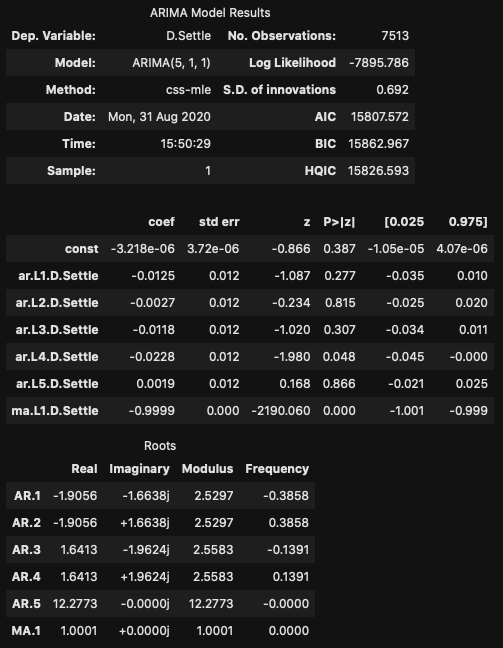
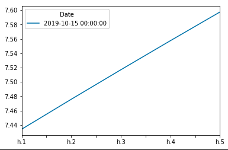
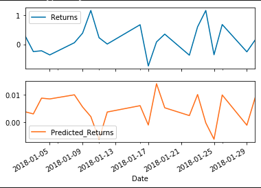
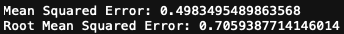
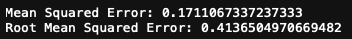

# time_series-a_yen_for_the_future

## Time Series Analysis

It's difficult to conclusively say buy or sell, but given the results of these
models, I would not recommend buying.  

The Hodrick-Prescott filter illustrates both trend and noise components of the 
price movement. The noise consistently sits between +$100 and -$100, topping 
out at +/-$300.  However, it is difficult to ascertain a consistent upward 
trend based on price history from 2015 to the present.

To take the analysis further, we projected future prices using both ARMA and 
ARIMA modelling techniques.  In comparing each of their 5-day price forecasts,
ARMA starts at a return of 0.012 and levels off at 0.006.  ARIMA starts off at
slighly below 0.015 and levels off at -0.005.  The ARMA model may be the 
slightly better model--it's AIC, BIC, and HQIC are all slightly lower than 
ARIMA's AIC, BIC, and HQIC.  On this evidence alone, the ARMA model suggests
buying would result in a short-term profit.

The final component of our time series analysis was volatility measurement via
the GARCH model.  The annualized 5-day forecast shows volatility increasing 
from 7.44 to 7.60.  Given a small projected percentage increase projected in 
ARMA, this level of risk increase may not be tolerable.

## Linear Regression

Utilizing a regression model based on X and y training data and applying it to 
X testing data, there does not appear to be much correlation between predicted 
and actual returns over the next 20 trading days.  Each major peak appears to
go in opposite directions.  Furthermore, the actual returns vary from about 
-0.5% to 1%, while the predicted returns' range is much smaller--0.015% to 
-0.005%.  This range could indicate a more conservative projection.

### In-Sample Performance

### Out-of-Sample Performance

Overall, this model appears to perform better with out-of-sample data compared
to in-sample data, although there is enough error in both cases to make one 
skeptical of its overall effectiveness.  Out-of-sample mean squared error 
(0.171 to to 0.498) and root mean squared error (0.414 to 0.706) were both lower
than in-sample readings.  By this measure the model may do a better job of 
predicting out-of-sample prices comparatively, but the size of the error makes
me hesitant to solely rely on this model to predict future prices.